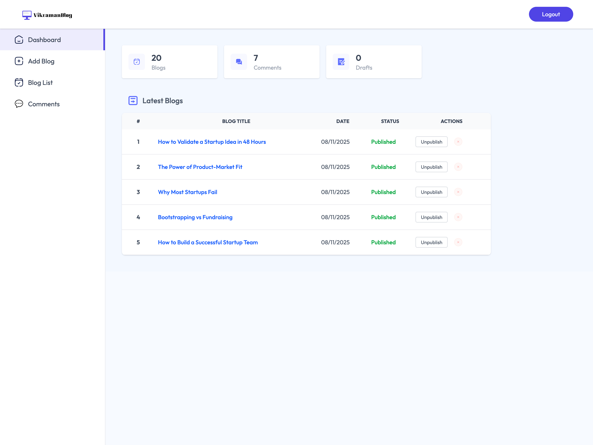
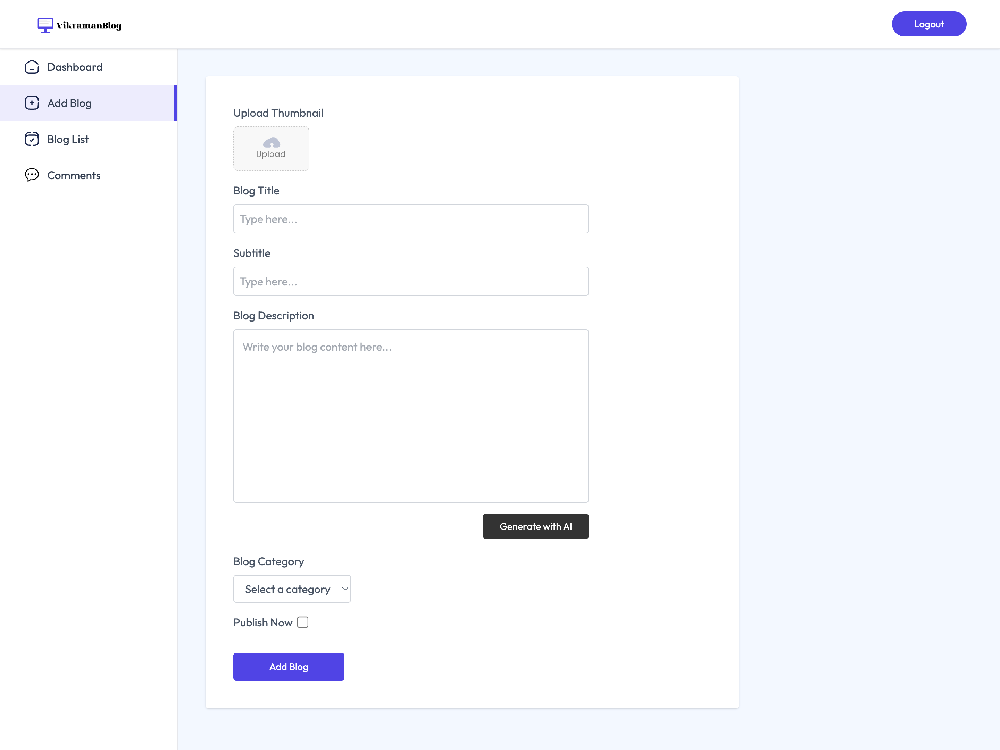

# 📝 Vikraman Blog — Full-Stack Blogging Platform (TypeScript MERN)

[](LICENSE)
[](https://nodejs.org/)
[](https://react.dev/)
[](https://www.mongodb.com/)

> A modern full-stack **TypeScript blogging platform** with admin dashboard, ImageKit CDN integration, AI-powered content generation (Groq), and secure JWT-based admin authentication. Built with **React + Vite + TailwindCSS + Express + MongoDB**.

---

## 🚀 Live Demo

👉 https://vikraman-blog.vercel.app

---

## 🖼️ Screenshots

### 🏠 Home Page


### 📊 Admin Dashboard



### ✍️ Add Blog



### 📚 List Blogs


---

## ✨ Features

### 🧠 AI-Powered Blog Creation

- Groq AI integration to auto‑generate full blog content.
- Markdown-to-HTML transformation.
- Auto‑formatting ensures headings, lists, links.

### 📰 Blog Management

- Create, update, delete blogs.
- Publish/unpublish toggle.
- Categories: Technology, Startup, Lifestyle, Finance.
- Optimized ImageKit uploads.

### 💬 Comment System

- Users can submit comments.
- Admin approval system.
- Delete/approve comment actions.

### 🔐 Secure Admin Auth

- Single admin login.
- JWT + middleware protection.
- Auto-logout on expiration.

### 🎨 UI/UX

- React 19 + TailwindCSS 4.
- motion/react animations.
- Responsive & modern UI.

---

## 🧰 Tech Stack

### Frontend

- React 19 + Vite 6 + TypeScript
- Tailwind CSS 4
- React Router DOM 7
- Axios
- Motion
- Moment.js
- React Hot Toast

### Backend

- Node.js 24+ with Express 5
- MongoDB + Mongoose 8
- JWT Authentication
- ImageKit SDK
- Multer
- Groq SDK

---

## 📂 Folder Structure

```
vikramanblog/
├── client/
│   ├── src/
│   ├── public/screenshots/
│   └── .env.example
├── server/
│   ├── src/
│   └── .env.example
└── README.md
```

---

## ⚙️ Environment Setup

### Server `.env`

```
PORT=3000
MONGODB_URI=your_mongo_uri
ADMIN_EMAIL=your_admin_email
ADMIN_PASSWORD=your_password
JWT_SECRET=your_jwt_secret
IMAGEKIT_PUBLIC_KEY=your_key
IMAGEKIT_PRIVATE_KEY=your_key
IMAGEKIT_URL_ENDPOINT=https://ik.imagekit.io/your_id
GROQ_API_KEY=your_key
```

### Client `.env`

```
VITE_BASE_URL=http://localhost:3000
```

---

## 🚀 Run Locally

### Install dependencies

```
cd server && npm install
cd ../client && npm install
```

### Run dev

```
cd server && npm run dev
cd client && npm run dev
```

---

## 📜 License

ISC License — see LICENSE

⭐ If you found this helpful, give it a star!
