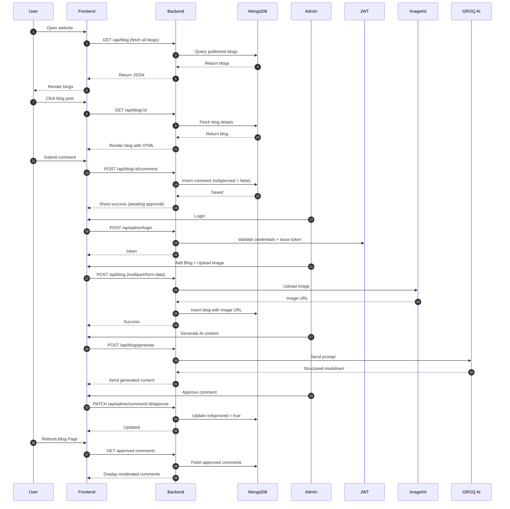

# 📖 Vikraman Blog – Full‑Stack MERN Blogging Platform

## 🌐 Live Deployment

- **Frontend:** https://vikraman-blog.vercel.app
- **Backend API:** https://vikraman-blog-server.vercel.app

A production‑ready blogging platform featuring AI‑assisted content creation, secure admin authentication, image optimization, comment moderation, and a clean UI built with React + TailwindCSS.

---

## 📝 Overview

Vikraman Blog is a full‑stack, scalable, modern blogging platform where administrators can publish blogs with rich formatting, generate content using AI, upload optimized images via ImageKit, and manage comments through a moderation workflow.
Users can explore blogs, filter by category, search in real time, read full posts, and submit comments.

This README includes:

- Complete feature overview
- Tech stack
- Project structure
- Architecture diagram
- **One combined, end‑to‑end Data Flow Diagram**
- API documentation
- Deployment
- Screenshots (placeholders)
- Contribution guide

---

## ✨ Features

### 🎯 User‑Facing Features

- Browse published blogs
- Read full articles with rich HTML formatting
- Real‑time search & category filtering
- Comment on blog posts
- Newsletter subscription UI
- Fully responsive layout
- Social sharing buttons

### 🔐 Admin Features

- JWT‑based authentication
- Add / publish / delete blogs
- AI content generation using GROQ LLaMA 3.3
- View dashboard analytics (blogs, comments, drafts)
- Moderate comments (approve / delete)
- Manage blog publication status
- Image upload to ImageKit with CDN optimization

### 🤖 AI Features

- Structured content generation from titles/prompts
- Markdown output auto-cleaned and parsed into HTML

---

## 🛠 Tech Stack

### Frontend

- React 19
- TypeScript
- Vite
- TailwindCSS 4
- React Router
- Axios
- React Hot Toast
- Marked (Markdown → HTML)
- Motion (animations)
- Moment.js

### Backend

- Node.js
- Express 5
- TypeScript
- MongoDB + Mongoose
- JWT Authentication
- Multer (file uploads)
- ImageKit (image optimization)
- GROQ SDK
- CORS

---

## 📁 Project Structure

```
vikraman-blog/
├── client/
│   ├── public/
│   │   └── screenshots/
│   ├── src/
│   │   ├── api/
│   │   │   └── axiosInstance.ts
│   │   ├── assets/
│   │   ├── components/
│   │   │   ├── admin/
│   │   │   ├── BlogCard.tsx
│   │   │   ├── BlogList.tsx
│   │   │   ├── Footer.tsx
│   │   │   ├── Header.tsx
│   │   │   ├── Loader.tsx
│   │   │   ├── Navbar.tsx
│   │   │   └── NewsLetter.tsx
│   │   ├── context/
│   │   │   ├── AppContext.ts
│   │   │   ├── AppProvider.tsx
│   │   │   └── useAppContext.ts
│   │   ├── pages/
│   │   │   ├── admin/
│   │   │   ├── Blog.tsx
│   │   │   └── Home.tsx
│   │   ├── types/
│   │   ├── App.tsx
│   │   ├── main.tsx
│   │   └── index.css
│   ├── vite.config.ts
│   └── tsconfig.json
│
└── server/
    ├── src/
    │   ├── configs/
    │   │   ├── db.ts
    │   │   ├── groq.ts
    │   │   └── imageKit.ts
    │   ├── controllers/
    │   │   ├── adminController.ts
    │   │   └── blogController.ts
    │   ├── middleware/
    │   │   ├── auth.ts
    │   │   └── multer.ts
    │   ├── models/
    │   │   ├── Blog.ts
    │   │   └── Comment.ts
    │   ├── routes/
    │   │   ├── adminRoutes.ts
    │   │   └── blogRoutes.ts
    │   ├── utils/
    │   │   ├── buildBlogPrompt.ts
    │   │   ├── fixMarkdown.ts
    │   │   └── sendError.ts
    │   └── server.ts
    ├── package.json
    └── tsconfig.json
```

---

## 🏗 Architecture

```
┌────────────────────────────────────────────────────────────┐
│                        CLIENT LAYER                        │
│          React + Vite + TypeScript + TailwindCSS          │
│               Calls backend via Axios HTTP                │
└───────────────────────────┬────────────────────────────────┘
                            │
                            ▼
┌────────────────────────────────────────────────────────────┐
│                         API LAYER                          │
│                   Node.js + Express 5                      │
│  Blog API | Comment API | Admin API | AI API | Upload API  │
└──────────────────────────┬─────────────────────────────────┘
                           │
         ┌─────────────────┼─────────────────┬─────────────────┐
         ▼                 ▼                 ▼                 ▼
┌───────────────┐ ┌────────────────┐ ┌────────────────┐ ┌───────────────────┐
│   MongoDB      │ │   ImageKit     │ │     GROQ AI    │ │   JWT Auth Layer  │
│ Blogs & Comments│ │  CDN + WebP    │ │  Content Gen   │ │ Token Validation  │
└───────────────┘ └────────────────┘ └────────────────┘ └───────────────────┘
```

---

## 🔄 Combined End‑to‑End Data Flow Diagram (Unified)


```mermaid
sequenceDiagram
    autonumber

    User->>Frontend: Open website
    Frontend->>Backend: GET /api/blog (fetch all blogs)
    Backend->>MongoDB: Query published blogs
    MongoDB-->>Backend: Return blogs
    Backend-->>Frontend: Return JSON
    Frontend-->>User: Render blogs

    User->>Frontend: Click blog post
    Frontend->>Backend: GET /api/blog/:id
    Backend->>MongoDB: Fetch blog details
    MongoDB-->>Backend: Return blog
    Backend-->>Frontend: Render blog with HTML

    User->>Frontend: Submit comment
    Frontend->>Backend: POST /api/blog/:id/comment
    Backend->>MongoDB: Insert comment (isApproved = false)
    MongoDB-->>Backend: Saved
    Backend-->>Frontend: Show success (awaiting approval)

    Admin->>Frontend: Login
    Frontend->>Backend: POST /api/admin/login
    Backend->>JWT: Validate credentials + issue token
    Backend-->>Frontend: token

    Admin->>Frontend: Add Blog + Upload Image
    Frontend->>Backend: POST /api/blog (multipart/form-data)
    Backend->>ImageKit: Upload image
    ImageKit-->>Backend: Image URL
    Backend->>MongoDB: Insert blog with image URL
    Backend-->>Frontend: Success

    Admin->>Frontend: Generate AI content
    Frontend->>Backend: POST /api/blog/generate
    Backend->>GROQ AI: Send prompt
    GROQ AI-->>Backend: Structured markdown
    Backend-->>Frontend: Send generated content

    Admin->>Frontend: Approve comment
    Frontend->>Backend: PATCH /api/admin/comment/:id/approve
    Backend->>MongoDB: Update isApproved = true
    Backend-->>Frontend: Updated

    User->>Frontend: Refresh Blog Page
    Frontend->>Backend: GET approved comments
    Backend->>MongoDB: Fetch approved comments
    Backend-->>Frontend: Display moderated comments
```

---

## 🔌 API Endpoints

### Public Routes

| Method | Endpoint                 | Description             |
| ------ | ------------------------ | ----------------------- |
| GET    | `/api/blog`              | Get all published blogs |
| GET    | `/api/blog/:id`          | Get single blog         |
| GET    | `/api/blog/:id/comments` | Get approved comments   |
| POST   | `/api/blog/:id/comment`  | Add comment             |

### Admin Routes

| Method | Endpoint                         | Description           |
| ------ | -------------------------------- | --------------------- |
| POST   | `/api/admin/login`               | Login & get JWT       |
| GET    | `/api/admin/dashboard`           | Dashboard data        |
| GET    | `/api/admin/blogs`               | All blogs             |
| GET    | `/api/admin/comments`            | All comments          |
| POST   | `/api/blog`                      | Create blog           |
| DELETE | `/api/blog/:id`                  | Delete blog           |
| PATCH  | `/api/blog/:id/publish`          | Toggle publish        |
| PATCH  | `/api/admin/comment/:id/approve` | Approve comment       |
| DELETE | `/api/admin/comment/:id`         | Delete comment        |
| POST   | `/api/blog/generate`             | AI content generation |

---

## 📸 Screenshots

> Replace filenames with your actual screenshot assets.

| Feature             | Screenshot                               |
| ------------------- | ---------------------------------------- |
| Home Page           | `public/screenshots/home.png`            |
| Blog Page           | `public/screenshots/blog.png`            |
| Admin Dashboard     | `public/screenshots/admin-dashboard.png` |
| Add Blog            | `public/screenshots/add-blog.png`        |
| Comments Moderation | `public/screenshots/comments.png`        |

---

## 🚀 Deployment

### Frontend (Vercel)

- Framework: **Vite**
- Command: `pnpm build`
- Output: `dist`

### Backend (Vercel)

- Command: `pnpm build`
- Output: `dist`
- Must enable **serverless functions**

---

## 🤝 Contributing

PRs welcome. Follow standard branching workflow.

---

## 📄 License

MIT License.

---

## 👤 Author

**Vikraman R**
GitHub: https://github.com/VIKRAMANR7

---

<div align="center">Made with ❤️ by Vikraman R</div>
