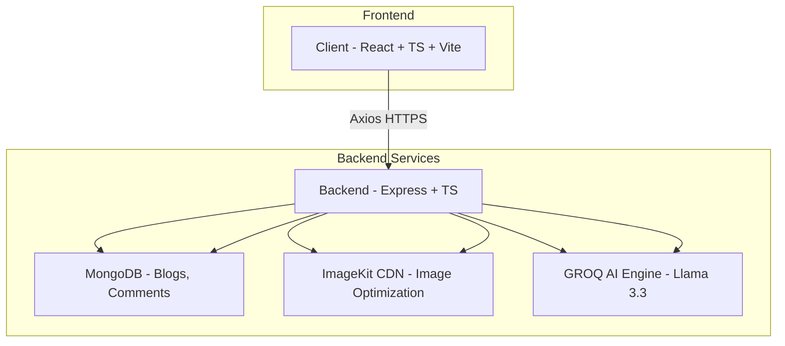
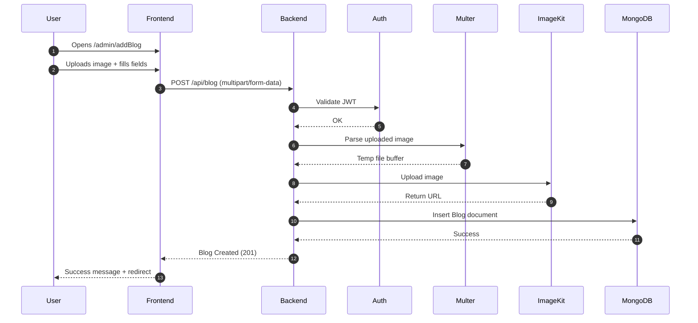
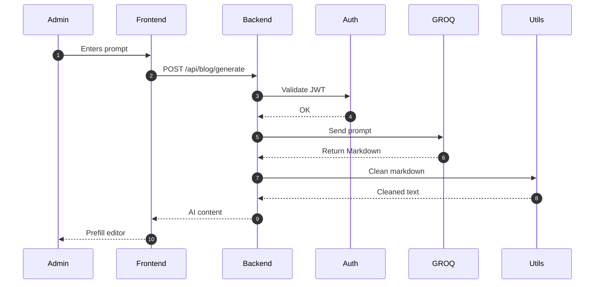
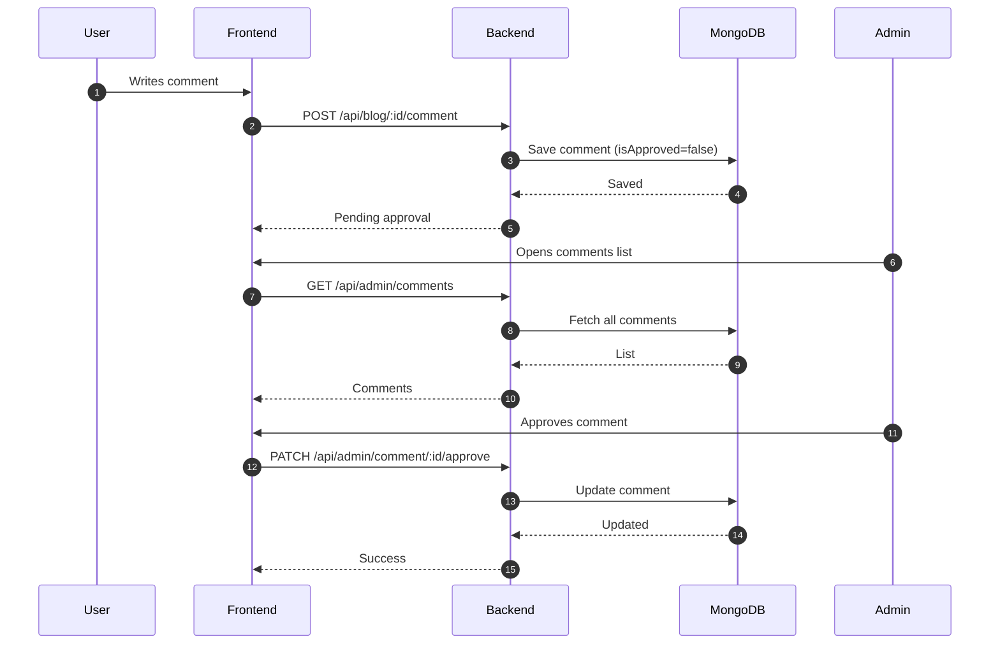
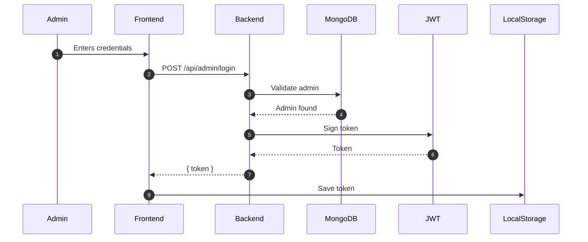
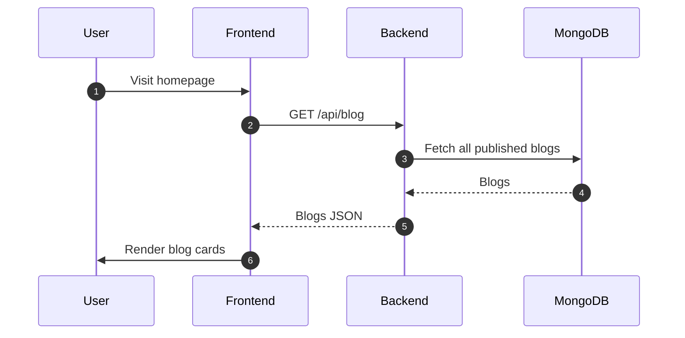

# Vikraman Blog – Full-Stack MERN Blogging Platform

A modern, production-ready blogging system built with **React, TypeScript, Node.js, Express, MongoDB, ImageKit, and GROQ AI**.
It includes **AI-powered blog generation**, **admin dashboard**, **JWT authentication**, **comment moderation**, and a clean responsive UI.

---

## 🌐 Live Demo

### **Frontend:** https://vikraman-blog.vercel.app/

### **Backend API:** https://vikraman-blog-server.vercel.app/

---

## 📋 Table of Contents

- [Overview](#overview)
- [Features](#features)
- [Tech Stack](#tech-stack)
- [Architecture](#architecture)
- [Data Flow Diagrams](#data-flow-diagrams)
- [Project Structure](#project-structure)
- [Screenshots](#screenshots)
- [Environment Variables](#environment-variables)
- [Getting Started](#getting-started)
- [API Documentation](#api-documentation)
- [Deployment](#deployment)
- [Contributing](#contributing)
- [License](#license)

---

## 🎯 Overview

**Vikraman Blog** is a complete blog management platform designed with production-level coding standards.
It includes:

- AI content generation using **GROQ Llama 3.3**
- Image optimization using **ImageKit**
- Admin panel with authentication & moderation
- Public-facing blog with categories, search, comments
- Modern UI with **TailwindCSS**, **React Router**, and **Motion**

---

## ✨ Features

### 🔥 Core Features

- Create, edit, delete blog posts
- AI-powered article generation
- Publish/unpublish workflow
- Full markdown → HTML rendering
- Image upload (with CDN + WebP optimization)
- Search + category filtering
- Responsive UI
- Comment system with admin approval

---

## 🛠️ Tech Stack

### Frontend

- React 19
- TypeScript
- Vite
- TailwindCSS 4
- Axios
- Motion / Framer
- Marked (Markdown parser)
- Moment.js
- React Router DOM

### Backend

- Node.js
- Express.js 5
- TypeScript
- MongoDB + Mongoose
- ImageKit
- GROQ (AI generation)
- Multer
- JWT authentication

---

## 🏗️ Architecture


```mermaid
flowchart TD

A[Client - React + TS + Vite] -- Axios HTTPS --> B[Backend - Express + TS]

B --> C[MongoDB - Blogs, Comments]
B --> D[ImageKit CDN - Image Optimization]
B --> E[GROQ AI Engine - Llama 3.3]

subgraph Frontend
A
end

subgraph Backend Services
B --> C
B --> D
B --> E
end
```

---

## 🔄 Data Flow Diagrams

### **1. Blog Creation (With Image + AI)**


```mermaid
sequenceDiagram
    autonumber
    User->>Frontend: Opens /admin/addBlog
    User->>Frontend: Uploads image + fills fields
    Frontend->>Backend: POST /api/blog (multipart/form-data)
    Backend->>Auth: Validate JWT
    Auth-->>Backend: OK

    Backend->>Multer: Parse uploaded image
    Multer-->>Backend: Temp file buffer

    Backend->>ImageKit: Upload image
    ImageKit-->>Backend: Return URL

    Backend->>MongoDB: Insert Blog document
    MongoDB-->>Backend: Success

    Backend-->>Frontend: Blog Created (201)
    Frontend-->>User: Success message + redirect
```

---

### **2. AI Content Generation**


```mermaid
sequenceDiagram
    autonumber
    Admin->>Frontend: Enters prompt
    Frontend->>Backend: POST /api/blog/generate
    Backend->>Auth: Validate JWT
    Auth-->>Backend: OK

    Backend->>GROQ: Send prompt
    GROQ-->>Backend: Return Markdown

    Backend->>Utils: Clean markdown
    Utils-->>Backend: Cleaned text

    Backend-->>Frontend: AI content
    Frontend-->>Admin: Prefill editor
```

---

### **3. Comment Lifecycle**


```mermaid
sequenceDiagram
    autonumber
    User->>Frontend: Writes comment
    Frontend->>Backend: POST /api/blog/:id/comment
    Backend->>MongoDB: Save comment (isApproved=false)
    MongoDB-->>Backend: Saved
    Backend-->>Frontend: Pending approval

    Admin->>Frontend: Opens comments list
    Frontend->>Backend: GET /api/admin/comments
    Backend->>MongoDB: Fetch all comments
    MongoDB-->>Backend: List
    Backend-->>Frontend: Comments

    Admin->>Frontend: Approves comment
    Frontend->>Backend: PATCH /api/admin/comment/:id/approve
    Backend->>MongoDB: Update comment
    MongoDB-->>Backend: Updated
    Backend-->>Frontend: Success
```

---

### **4. Authentication (JWT Login)**


```mermaid
sequenceDiagram
    autonumber
    Admin->>Frontend: Enters credentials
    Frontend->>Backend: POST /api/admin/login
    Backend->>MongoDB: Validate admin
    MongoDB-->>Backend: Admin found
    Backend->>JWT: Sign token
    JWT-->>Backend: Token
    Backend-->>Frontend: { token }
    Frontend->>LocalStorage: Save token
```

---

### **5. Home Page**


```mermaid
sequenceDiagram
    autonumber
    User->>Frontend: Visit homepage
    Frontend->>Backend: GET /api/blog
    Backend->>MongoDB: Fetch all published blogs
    MongoDB-->>Backend: Blogs
    Backend-->>Frontend: Blogs JSON
    Frontend->>User: Render blog cards
```

---

## 📁 Project Structure

```
vikraman-blog/
├── client/
│   ├── public/
│   │   └── screenshots/
│   │       ├── home.png
│   │       ├── dashboard.png
│   │       ├── addblog.png
│   │       └── listblog.png
│   ├── src/
│   │   ├── api/
│   │   ├── assets/
│   │   ├── components/
│   │   ├── context/
│   │   ├── pages/
│   │   ├── types/
│   │   ├── App.tsx
│   │   └── main.tsx
│   └── package.json
│
└── server/
    ├── src/
    │   ├── configs/
    │   ├── controllers/
    │   ├── middleware/
    │   ├── models/
    │   ├── routes/
    │   ├── utils/
    │   └── server.ts
    └── package.json
```

---

## 📸 Screenshots

### 🏠 Home Page


### 📊 Admin Dashboard


### ➕ Add Blog


### 📚 Blog List


---

## 🔑 Environment Variables

### **Server (.env)**

```
PORT=3000
MONGODB_URI=your_mongodb_url

ADMIN_EMAIL=admin@example.com
ADMIN_PASSWORD=yourpassword
JWT_SECRET=your_jwt_secret

IMAGEKIT_PUBLIC_KEY=your_key
IMAGEKIT_PRIVATE_KEY=your_key
IMAGEKIT_URL_ENDPOINT=https://ik.imagekit.io/your_space

GROQ_API_KEY=your_groq_key
```

### **Client (.env)**

```
VITE_BASE_URL=http://localhost:3000
```

---

## 🚀 Getting Started

### Backend

```
cd server
pnpm install
pnpm dev
```

### Frontend

```
cd client
pnpm install
pnpm dev
```

---

## 📡 API Documentation (Summary)

| Method | Endpoint                       | Description       |
| ------ | ------------------------------ | ----------------- |
| GET    | /api/blog                      | Fetch blogs       |
| GET    | /api/blog/:id                  | Fetch single blog |
| POST   | /api/blog                      | Create blog       |
| DELETE | /api/blog/:id                  | Delete blog       |
| POST   | /api/blog/:id/comment          | Add comment       |
| PATCH  | /api/blog/:id/publish          | Toggle publish    |
| POST   | /api/blog/generate             | AI content        |
| GET    | /api/admin/comments            | Admin comments    |
| PATCH  | /api/admin/comment/:id/approve | Approve comment   |

---

## 🌐 Deployment

### Frontend (Vercel)

Build → `pnpm build`
Output → `dist`

### Backend (Vercel)

Build → `pnpm build`
Output → `dist`

---

## 🤝 Contributing

Pull Requests are welcome!

---

## 📄 License

MIT License.

---

## 👤 Author

**Vikraman R**
GitHub: https://github.com/VIKRAMANR7

---

Made with ❤️
